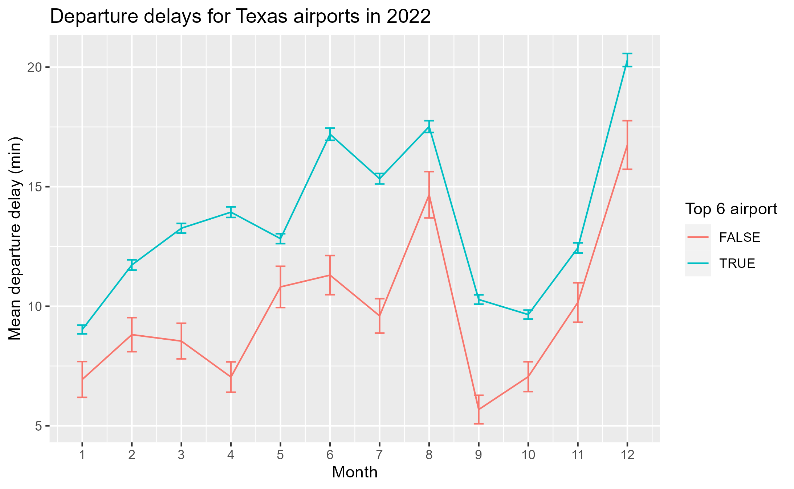
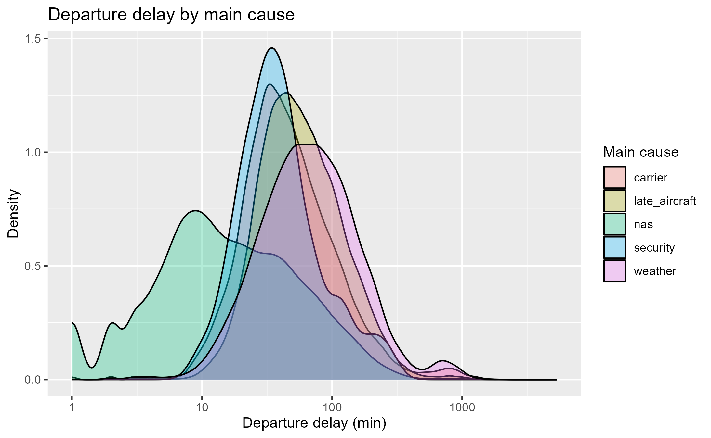
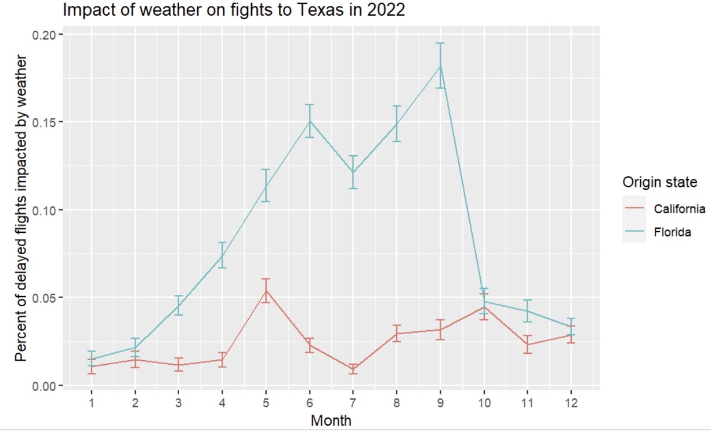

```{r, include=FALSE}
htmltools::tagList(rmarkdown::html_dependency_font_awesome())
```

---

<header>
<h1>Exploratory Analysis</h1>
</header>

<section>
<nav>
  <ul>
    <li><a href="#first">First Objective</a></li>
    <br>
    <li><a href="#second">Second Objective</a></li>
    <br>
    <li><a href="#third">Third Objective</a></li>
    <br>
  </ul>
</nav>

<article>
  <h1 id="first">What is the relationship between airports and delay times?</h1>
  <br>
  <p>We predicted that major airports experience longer delays because they experience more traffic and flights covering longer distances. We defined airport size to be the number of flights from the airport. Our cutoff was 30,000 flights to be considered a top airport.</p>
  <br>
  
  <br>
  <p>We can see that larger and smaller airports follow a similar monthly trend. We can also see that larger airports have a higher mean departure delay than smaller airports.</p>
  <br>
  <h1 id="second">What kind of delay causes the longest departure delay?</h1>
  <br>
  <p>We predicted that weather delay is the most important predictor of delay times because it is assumed to be uncontrollable. We assumed that departure and arrival delays for the same flight have the same main cause. We also only looked at late departures so we assumed on time departures don't have any delays.</p>
  <br>
  
  <br>
  <p>Based on visual interpretation weather delay has the longest delay time. Late aircraft seems second to weather delay. Higher delay times with less density may be outliers so we focused on the causes with higher density areas. </p>
  <br>
  <h1 id="third">Are weather delays specific to certain months?</h1>
  <br>
  <p>We predict that weather delays are specific to certain months for example colder months or hurricane season months. We used Florida and California as a comparison since they had a similar number of outgoing flights to Texas. We assumed hurricane season to be June through November.</p>
  <br>
  
  <br>
  <p> We can see that Florida has a higher percent of delayed flights due to weather yearly compared to California. The months June through August see the highest percentage of delayed flights for Florida. </p>
  <p> Florida is known for its hurricanes and the trend reflects that; There are more delays during hurricane season months. Weather delays can be specific to certain months. </p>
  <br>
  </article>
</section>
