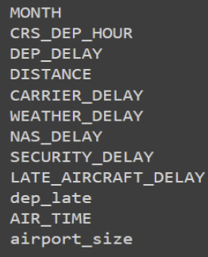
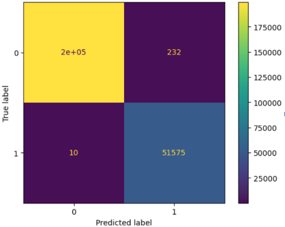
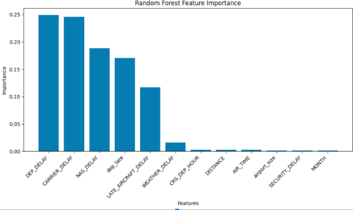
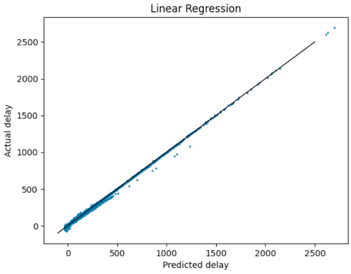
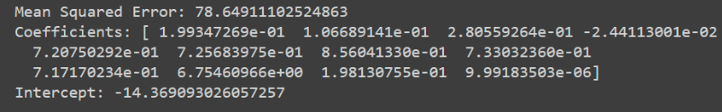
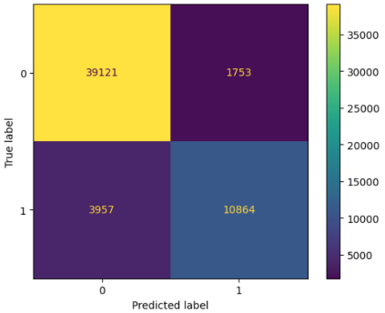
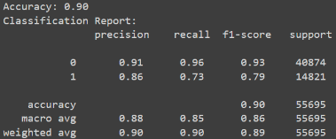
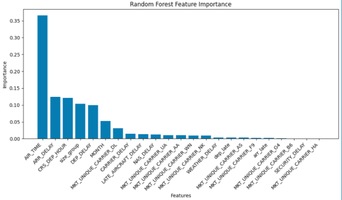

```{r, include=FALSE}
htmltools::tagList(rmarkdown::html_dependency_font_awesome())
```

---

<header>
<h1>Modeling</h1>
</header>

<section>
<nav>
  <ul>
    <li><a href="#firstpredict">First Prediction</a></li>
    <br>
    <li><a href="#secondpredict">Second Prediction</a></li>
    <br>
    <li><a href="#thirdpredict">Third Prediction</a></li>
    <br>
    <li><a href="#conclude">Summary</a></li>
    <br>
  </ul>
</nav>

<article>
  <h1 id="firstpredict">First Prediction</h1>
  <br>
  <p>We tried to predict if a flight will arrive late using Random Forest Classification. Below are the features we used. Airport size was defined as the number of flights from an airport.</p>
  
  <br>
  <p>We created a confusion matrix to show the performance of the Random Forest Classification.</p>
  <br>
  
  <br>
  <br>
  <p>The cause of a delay is important in predicting if a flight will arrive late. From the Random Forest Feature Importance below we can see that weather delay has the second least importance after security delay. Departure delay has the most importance which makes sense since a flight that leaves late will arrive late.</p>
  <br>
  
  <br>
  <h1 id="secondpredict">Second Prediction</h1>
  <p>We then tried to predict the actual arrival delay using linear regression. We assumed there was a linear relationship between the feature variables (same ones from above) and arrival delay times.
  <br>
  <br>
  
  <br>
  
  <br>
  <h1 id="thirdpredict">Third Prediction</h1>
  <p>We then tired to predict if the origin state is hurricane prone using Random Forest Classification. We filtered for flights from non-Texas states to Texas. We also dropped some feature variables which include: Distance, Airport Size, Origin State Name, and Destination State Name. Now, we have a new variable called size group which groups airports with similar numbers of flights together. Texas was filtered out to account for the higher volume of flights at Texas airports.</p>
  <p> Below is the confusion matrix we created along with the classification report.
  <br>
  <br>
  
  <br>
  
  <br>
  <p>We looked at the Random Forest feature importance again. Weather delay was still not a good predictor of whether a state is hurricane prone. Air time has the greatest importance which can be explained by the fact that hurricane prone states are close to Texas.
  <br>
  <br>
  
  <br>
  <h1 id="conclude">Summary</h1>
  <br>
  <p>Larger Texas airports have increased mean departure delay times.</p>
  <br>
  <p>Delays caused by weather are on average longer than other delays.</p>
  <br>
  <p>Weather delays can be specific to certain months with Florida having delays prevalent during hurricane season.</p>
  <br>
  <p>Mean weather delays is not indicative of a state being hurricane prone signifying that additional weather events may influence prediction.</p>
  <br>
  </article>
</section>