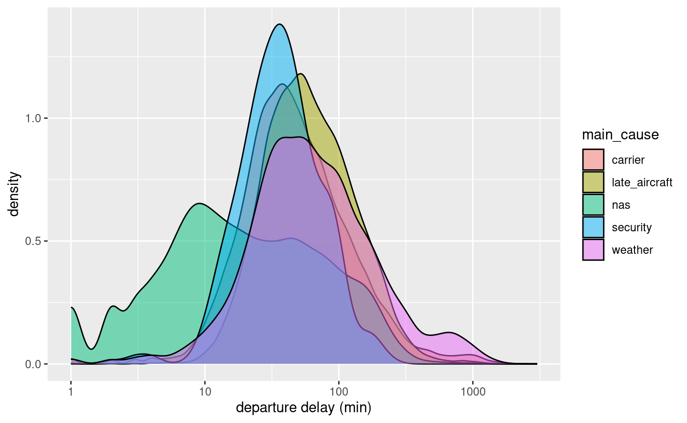

## Project Overview:

**Description**: 

Our project analyzes the data of domestic flights within America in order to find unique relationships between certain factors that can vary for an airplane's flight.

**Goals**:

- Look at the relationship between airports and delay times 
  - Are some airports better at avoiding delays? (least amount of delays? Or shortest delay times? either) 
  - What kind of delays are they better at avoiding? 
  
- Look at what kind of delay causes the longest departure delay 

**Data**:

The Airline On-Time Performance Data is a data set collected over time by the United States Department of Transportation. In this dataset, carriers report data for the flights operated, including their arrival/departure dates, carrier, origin, airport, causes of delay and cancellation, air time, and non-stop distance. The dataset spans from 1987 to the present. 
https://drive.google.com/file/d/1ewoXW2YnCfzAoJ-pPHaR0raOpHCyktMi/view?usp=drive_web

**Hypotheses**:

- What is the relationship between airports and delay times 
  - We predict that major airports in America are best at avoiding delays.

- What kind of delay causes the longest departure delay 
  - We predict that averaged across all airports, the security delay has the shortest delay time, and the weather        delay has the longest delay time.

**References**:
https://www.transtats.bts.gov/Fields.asp?gnoyr_VQ=FGJ

**Data Visualizations**:

